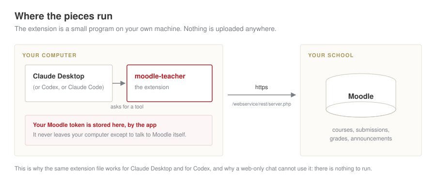
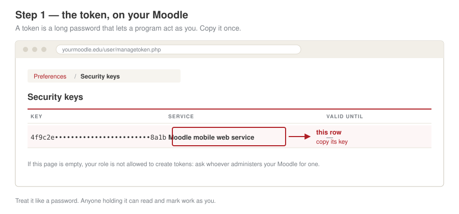
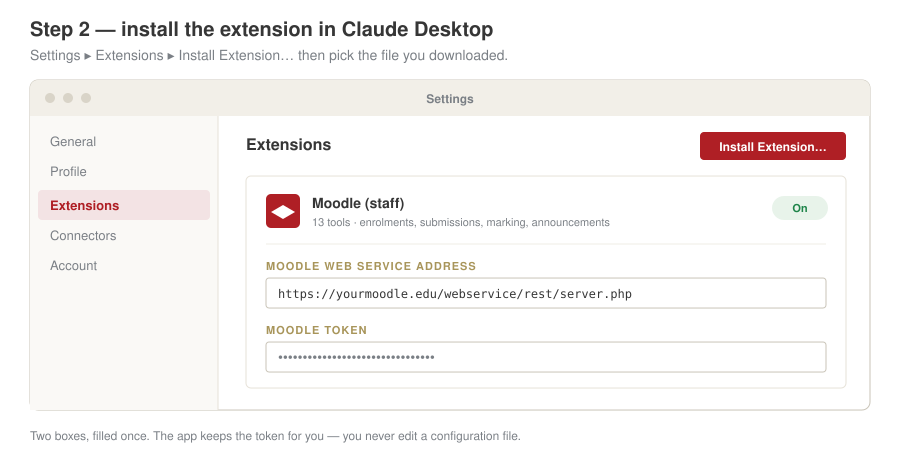

# Connecting it, without the terminal

This page is for the person who teaches, not the person who packages software.
There is no command to type. You download one file, double-click it, and paste
two things into two boxes.

If you are comfortable at a command line, the [README](../README.md) has the
shorter route.

## First, what you are actually installing



An **extension** is a small program that runs on your own computer, next to
Claude. When you ask a question about your course, Claude asks the extension,
the extension asks Moodle, and the answer comes back. Your Moodle token stays on
your machine; it is used to talk to Moodle and to nothing else.

This also explains a limit worth knowing before you try: a chat that runs only
in a web browser has nowhere to run the program, so it cannot use this. You need
an app installed on your computer — Claude Desktop, or Codex, or Claude Code.

## Step 1 — get your token from Moodle



1. Sign in to your Moodle in a browser.
2. Click your name, top right → **Preferences** → **Security keys**.
3. Copy the key on the row that says **Moodle mobile web service**.

Also note your Moodle's address. You will need it with `/webservice/rest/server.php`
on the end, like `https://moodle.example.edu/webservice/rest/server.php`. Use the
exact spelling your Moodle uses for itself: if it answers on `moodle.example.edu`,
adding `www.` will fail with a message about `requirecorrectaccess`.

**If the Security keys page is empty**, your account is not allowed to create
tokens. That is a setting on the Moodle, not something you did wrong. Ask
whoever administers it for a token for the mobile web service; or, if you do
have a terminal, `scripts/get-moodle-token.sh` in this repository asks Moodle
for one directly.

Treat the token like a password. Whoever holds it can read submissions and mark
work as you. Do not email it, do not paste it into a chat, and do not share
yours with a colleague — each teacher uses their own.

## Step 2 — install the extension in Claude Desktop



1. Download `mcp-moodle-teacher.mcpb` from the
   [latest release](https://github.com/NiccoloSalvini/mcp-moodle-teacher/releases/latest).
2. Open Claude Desktop → **Settings** → **Extensions**.
3. **Install Extension…** and choose the file you just downloaded. (Double-clicking
   the file in Finder or Explorer does the same thing.)
4. Two boxes appear. Paste your Moodle web service address in the first and your
   token in the second.
5. Leave the extension switched **On**.

The app stores the token for you. You never open a configuration file, and the
token is not written into any document you might later share.

## Step 3 — check it works

Ask Claude, in plain words:

> Which Moodle courses am I teaching?

You should get your courses back, each with a number next to it. That number is
the course id, and it is what the other questions need. Then try:

> In course 2546, who has not submitted assignment 1?

If something fails, ask:

> Run whoami on Moodle

It reports which account the token belongs to, which Moodle it is pointing at,
and whether that token is permitted to read submissions, mark work and post
announcements. Nearly every failure is one of those permissions missing, not a
broken install.

## Codex

Codex reads a small configuration file, and it has a command that writes it for
you. This one is unavoidably a terminal step, but it is a single line:

```bash
codex mcp add moodle \
  --env MOODLE_URL=https://moodle.example.edu/webservice/rest/server.php \
  --env MOODLE_TOKEN=paste-your-token-here \
  -- npx -y mcp-moodle-teacher
```

`codex mcp list` then shows it. The same extension logic applies: the program
runs on your machine.

## Claude Code

In the folder of the course you are working on, create `.mcp.json`:

```json
{
  "mcpServers": {
    "moodle": {
      "command": "npx",
      "args": ["-y", "mcp-moodle-teacher"],
      "env": {
        "MOODLE_URL": "${MOODLE_URL}",
        "MOODLE_TOKEN": "${MOODLE_TOKEN}"
      }
    }
  }
}
```

Keep the real values in a `.env` file that is never committed, and load them
before you start: `set -a; . .env; set +a`.

## What to ask it

The useful questions are the ones you would otherwise answer by clicking through
Moodle for ten minutes:

- *Who has not submitted homework 3 in the Research course?*
- *Show me what Kurai handed in for assignment 2.*
- *Which students have not logged in since the course started?*
- *Draft an announcement saying the deadline moves to Sunday, and show it to me
  before posting.*

Two of the thirteen tools change Moodle: one puts a mark and feedback on a
submission, one posts an announcement to the whole class. The extension tells
Claude to show you the wording and the numbers before either happens. Read what
it proposes before you say yes; an announcement emails everyone enrolled, and a
mark overwrites whatever was there.

## A word about what Claude sees

These tools return real names, email addresses and submitted work. Anything the
assistant reads becomes part of that conversation. Prefer asking for the shape
of the answer — *how many are missing?*, *is anyone at risk?* — and ask for
names when you actually need them.
